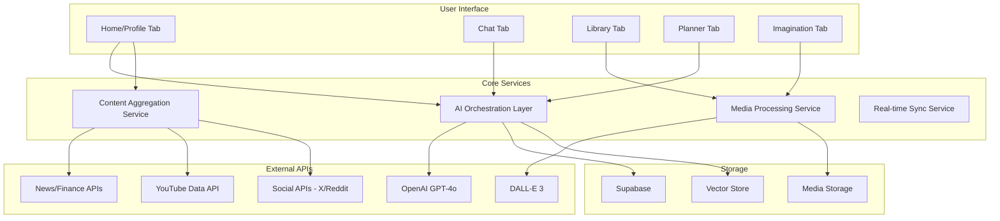
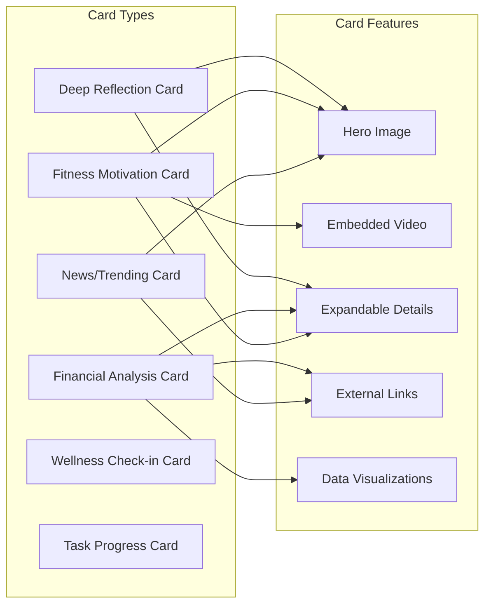
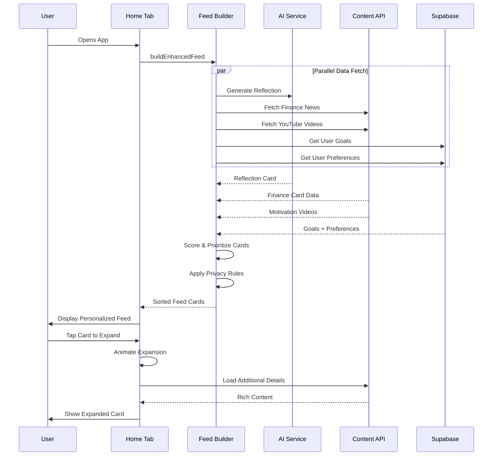
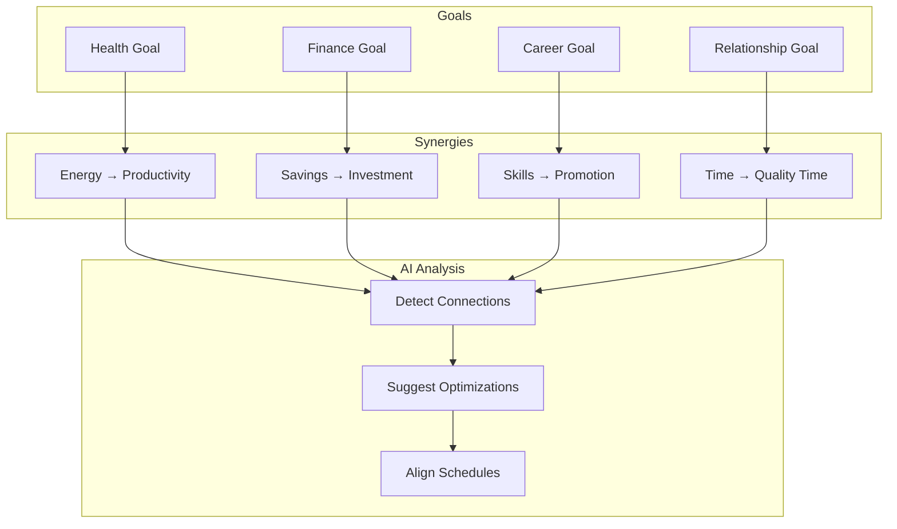

# Happiness AI - PRD Gap Analysis & Implementation Plan

## Executive Summary

After thorough analysis of the current codebase against the PRD requirements, I've identified significant gaps across 5 main areas. This document provides a detailed implementation plan to bring the app to full PRD compliance.

---

## 🔴 PRD Compliance Status

| Tab              | Current | PRD Target | Gap Level   |
| ---------------- | ------- | ---------- | ----------- |
| **Home/Profile** | 35%     | 100%       | 🔴 Major    |
| **Chat/AI**      | 60%     | 100%       | 🟡 Moderate |
| **Library**      | 40%     | 100%       | 🟡 Moderate |
| **Planner**      | 45%     | 100%       | 🟡 Moderate |
| **Imagination**  | 30%     | 100%       | 🔴 Major    |

---

## 📊 Architecture Overview



---

## 📱 Phase 11: Enhanced Home Page (Deep Reflection Experience)

### Current State

- Basic AI-generated quote/insight cards
- Simple task cards from planner
- No images, no expandable content, no external data

### PRD Requirements (Missing)

1. **Rich Media Cards** with images, videos, graphs
2. **Expandable Cards** showing detailed content on tap
3. **Financial Analysis** with market trends, AI predictions
4. **Fitness/Wellness** with YouTube motivation, before/after AI images
5. **Deep Reflection Prompts** with meaningful impact
6. **External Content** from X, Reddit, Quora, credible sources
7. **Privacy-aware** content hiding when outside home
8. **Context-aware** by time, location, mood

### Implementation Plan

#### 11.1 New Card Types Architecture



#### 11.2 New Services Required

**a) Content Aggregation Service** (`lib/contentAggregation.ts`)

```typescript
interface ContentSource {
  type: 'x' | 'reddit' | 'quora' | 'news' | 'youtube';
  apiKey?: string;
  relevanceScore: number;
}

interface AggregatedContent {
  id: string;
  source: ContentSource;
  title: string;
  summary: string;
  image?: string;
  videoUrl?: string;
  relevance: 'high' | 'medium' | 'low';
  category: 'finance' | 'fitness' | 'tech' | 'wellness' | 'personal';
}

// Functions:
// - fetchFinancialNews(): Market trends, AI impact, user's portfolio
// - fetchMotivationalContent(): YouTube videos, quotes, success stories
// - fetchUserRelevantNews(): Based on user interests/goals
// - analyzeContentRelevance(): AI-powered relevance scoring
```

**b) Deep Reflection Service** (`lib/deepReflection.ts`)

```typescript
interface ReflectionPrompt {
  id: string;
  type: 'morning' | 'midday' | 'evening' | 'milestone';
  prompt: string;
  context: string;
  suggestedActions: string[];
  relatedGoals: string[];
}

// Functions:
// - generateMorningReflection(): Based on day's goals
// - generateMilestoneReflection(): When goal progress changes
// - generateDeepQuestion(): Philosophical prompts for growth
```

#### 11.3 Enhanced Card Components

**Financial Card with Expansion:**

```
┌─────────────────────────────────────┐
│ 📊 FINANCIAL INSIGHT                │
│ [Market Chart Image]                │
│                                     │
│ "AI Stocks Surge Amid OpenAI News"  │
│ Your portfolio is up 2.3% today     │
│                                     │
│ [View Details ▼]                    │
└─────────────────────────────────────┘

EXPANDED:
┌─────────────────────────────────────┐
│ 📊 FINANCIAL INSIGHT                │
│ [Larger Interactive Chart]          │
│                                     │
│ WHAT YOU MUST KNOW                  │
│ "NVIDIA hits all-time high as AI    │
│  demand continues to accelerate..." │
│                                     │
│ TRENDING & INVESTED                 │
│ [NVDA +5%] [MSFT +2%] [BTC +1.2%]   │
│                                     │
│ EXPERT PREDICTION                   │
│ 🎯 "Hold positions, volatility      │
│    expected through Q4..."          │
│                                     │
│ [Read on X] [Bloomberg] [Yahoo]     │
└─────────────────────────────────────┘
```

**Fitness Motivation Card with Video:**

```
┌─────────────────────────────────────┐
│ 💪 TODAY'S WORKOUT                  │
│ [Motivation Video Thumbnail ▶]      │
│                                     │
│ "Leg Day - Remember your goal"      │
│ 8 weeks in • 12 to go               │
│                                     │
│ [View Details ▼]                    │
└─────────────────────────────────────┘

EXPANDED:
┌─────────────────────────────────────┐
│ 💪 TODAY'S WORKOUT                  │
│                                     │
│ REMEMBER WHY YOU STARTED            │
│ "I want to feel confident and       │
│  energetic for my family"           │
│                                     │
│ YOUR TRANSFORMATION                 │
│ [Day 1 Photo] → [AI Goal Photo]     │
│   "Before"      "Your Target"       │
│                                     │
│ MOTIVATION                          │
│ [YouTube Video Player]              │
│ "David Goggins - Stay Hard"         │
│                                     │
│ TODAY'S ROUTINE                     │
│ ☐ Squats 4x12                       │
│ ☐ Leg Press 3x15                    │
│ ☐ Lunges 3x10                       │
└─────────────────────────────────────┘
```

**Deep Reflection Card:**

```
┌─────────────────────────────────────┐
│ 🪷 MORNING REFLECTION               │
│ [Serene Image - Nature/Abstract]    │
│                                     │
│ "What is the ONE thing today that,  │
│  if accomplished, would make        │
│  everything else easier?"           │
│                                     │
│ Based on your goals:                │
│ • Financial independence journey    │
│ • Health transformation             │
│                                     │
│ [Reflect Now →]                     │
└─────────────────────────────────────┘
```

#### 11.4 Data Flow for Home Feed



---

## 📚 Phase 12: Library Tab Overhaul

### Current State

- Basic Personal/Notes toggle
- Simple media grid
- Basic search

### PRD Requirements (Missing)

1. **Instagram-like Grid** with inline video playback
2. **Detailed view** on tap with metadata, tags, comments
3. **Filter by project/goal**
4. **Meeting minutes** with sentiment analysis
5. **Voice memo transcripts** with speaker identification
6. **Robust search** across all content

### Implementation Plan

#### 12.1 UI Redesign

```
PERSONAL VIEW (Instagram-style):
┌─────────────────────────────────────┐
│ 📚 Library    [🔍] [≡ Filter]       │
│ ─────────────────────────────────── │
│ [Personal] [Notes] [Search...]      │
│                                     │
│ [All] [Images] [Videos] [Audio]     │
│ [By Goal ▼]                         │
│                                     │
│ ┌─────┐ ┌─────┐ ┌─────┐            │
│ │ 📷  │ │ 🎬  │ │ 📷  │            │
│ │     │ │ ▶   │ │     │            │
│ └─────┘ └─────┘ └─────┘            │
│ ┌─────┐ ┌─────┐ ┌─────┐            │
│ │ 🎤  │ │ 📷  │ │ 🎬  │            │
│ │     │ │     │ │ ▶   │            │
│ └─────┘ └─────┘ └─────┘            │
└─────────────────────────────────────┘

DETAILED VIEW (On Tap):
┌─────────────────────────────────────┐
│ [←] Sunset Photo                    │
│ ─────────────────────────────────── │
│ [Full Image/Video Player]           │
│                                     │
│ 📅 Nov 24, 2024 • 📍 Miami Beach    │
│                                     │
│ Tags: #travel #vacation #sunset     │
│                                     │
│ 💬 Notes:                           │
│ "Beautiful sunset on day 3 of our   │
│  anniversary trip..."               │
│                                     │
│ 🎯 Linked Goals: Travel More        │
│                                     │
│ [Edit] [Share] [Delete]             │
└─────────────────────────────────────┘

NOTES VIEW (Meeting Minutes):
┌─────────────────────────────────────┐
│ 📝 Project Kickoff Meeting          │
│ ─────────────────────────────────── │
│ 📅 Today, 10:00 AM • 45 min         │
│ 👥 Alice, Bob, Charlie              │
│                                     │
│ SENTIMENT: 😊 Positive (85%)        │
│                                     │
│ SUMMARY                             │
│ "Team aligned on Q1 roadmap.        │
│  Budget approved for new hires..."  │
│                                     │
│ ACTION ITEMS                        │
│ ☑ Create Jira tickets - Alice       │
│ ☐ Schedule follow-up - Bob          │
│ ☐ Send budget proposal - Charlie    │
│                                     │
│ KEY MOMENTS                         │
│ [00:05] Budget discussion           │
│ [00:23] Timeline concerns           │
│ [00:38] Next steps agreed           │
│                                     │
│ [Play Recording] [Edit] [Export]    │
└─────────────────────────────────────┘
```

#### 12.2 New Services Required

**Sentiment Analysis Service** (`lib/sentimentAnalysis.ts`)

```typescript
interface SentimentResult {
  overall: 'positive' | 'neutral' | 'negative';
  score: number; // 0-100
  keyMoments: {
    timestamp: string;
    sentiment: string;
    topic: string;
  }[];
  speakers: {
    name: string;
    sentiment: string;
    speakingTime: number;
  }[];
}

// Use OpenAI to analyze meeting transcripts
async function analyzeMeetingSentiment(
  transcript: string
): Promise<SentimentResult>;
```

---

## 📋 Phase 13: Planner Tab Overhaul

### Current State

- Basic goal list with progress
- Simple milestone dots
- Create goal modal

### PRD Requirements (Missing)

1. **Multi-goal Synergy** - Goals connect and align
2. **Research AI** - Motivation examples, comparable success stories
3. **Week/Day Timeline** - Visual breakdown
4. **AI-generated plans** from voice/chat
5. **Motivational images** (not just quotes)
6. **Integration with Profile** - Awards, celebrations

### Implementation Plan

#### 13.1 UI Redesign

```
GOAL OVERVIEW:
┌─────────────────────────────────────┐
│ 🎯 Your Journey    [+ New Goal]     │
│ ─────────────────────────────────── │
│ [Motivational Image - Success]      │
│ "The process shapes the person"     │
│                                     │
│ GOAL SYNERGY MAP                    │
│ ┌───────────────────────────────┐   │
│ │    [Health 💪]                │   │
│ │       ↓    ↘                  │   │
│ │  [Energy] → [Productivity]    │   │
│ │       ↓         ↓             │   │
│ │    [Focus] → [Finance 💰]     │   │
│ └───────────────────────────────┘   │
│                                     │
│ THIS WEEK'S FOCUS                   │
│ ┌─────────────────────────────────┐ │
│ │ 💪 Complete 4 workouts          │ │
│ │ 📚 Read 30 pages                │ │
│ │ 💰 Review investment portfolio  │ │
│ └─────────────────────────────────┘ │
└─────────────────────────────────────┘

GOAL DETAIL VIEW:
┌─────────────────────────────────────┐
│ [←] Get Fit in 2024                 │
│ ─────────────────────────────────── │
│ ████████████░░░░░░░░ 62%            │
│                                     │
│ [Inspiration Image]                 │
│ "You've come so far. Don't stop."   │
│                                     │
│ CONNECTED TO                        │
│ [Energy Levels] [Mental Clarity]    │
│                                     │
│ THIS WEEK                           │
│ Mon ████ Tue ████ Wed ░░░░          │
│ Thu ░░░░ Fri ░░░░ Sat ░░░░ Sun ░░░░ │
│                                     │
│ TODAY'S TASKS                       │
│ ☐ Morning workout (7:00 AM)         │
│ ☐ Meal prep for week                │
│ ☐ Log calories                      │
│                                     │
│ PEOPLE LIKE YOU WHO SUCCEEDED       │
│ ┌─────────────────────────────────┐ │
│ │ 🏆 "Started at 200lbs, now at   │ │
│ │    165lbs after 8 months..."    │ │
│ │    - Reddit r/fitness           │ │
│ └─────────────────────────────────┘ │
│                                     │
│ [AI: Generate Weekly Plan]          │
└─────────────────────────────────────┘
```

#### 13.2 Goal Synergy System



---

## 🔐 Privacy & External APIs Required

### API Keys Needed

| Service                           | Purpose           | Priority |
| --------------------------------- | ----------------- | -------- |
| **Alpha Vantage / Yahoo Finance** | Stock market data | High     |
| **YouTube Data API**              | Motivation videos | High     |
| **News API**                      | Trending news     | Medium   |
| **Reddit API**                    | Community content | Medium   |
| **X (Twitter) API**               | Social trending   | Low      |

### Privacy Rules

```typescript
interface PrivacyContext {
  isAtHome: boolean; // Detected via location
  isPrivateTime: boolean; // User-defined hours
  sensitiveContentEnabled: boolean;
}

// Privacy-aware content filtering
function filterContentForPrivacy(
  cards: FeedCard[],
  privacy: PrivacyContext
): FeedCard[] {
  if (!privacy.isAtHome) {
    // Hide financial details, personal photos, etc.
    return cards.filter((c) => !c.isSensitive);
  }
  return cards;
}
```

---

## 📅 Implementation Timeline

### Week 1-2: Phase 11 (Home Page)

- Day 1-2: Content Aggregation Service
- Day 3-4: Enhanced FeedCard with expansion
- Day 5-6: Financial card implementation
- Day 7-8: Fitness card with video
- Day 9-10: Deep reflection system
- Day 11-14: Testing & polish

### Week 3: Phase 12 (Library)

- Day 1-2: Instagram-style grid
- Day 3-4: Detailed media view
- Day 5-6: Meeting minutes with sentiment
- Day 7: Search improvements

### Week 4: Phase 13 (Planner)

- Day 1-2: Goal synergy system
- Day 3-4: Week/Day timeline view
- Day 5-6: Research AI integration
- Day 7: Profile integration

---

## 🎯 Immediate Action Items

Based on your request, here are the prioritized changes:

### 1. Home Page - Rich Cards (Highest Priority)

- [ ] Create `lib/contentAggregation.ts` for external content
- [ ] Enhance `FeedCard.tsx` with image support and expansion
- [ ] Add financial card type with market data
- [ ] Add fitness card type with YouTube embed
- [ ] Implement deep reflection prompts

### 2. Library Tab - Meeting Minutes

- [ ] Redesign to Instagram-style grid
- [ ] Add inline video playback
- [ ] Implement sentiment analysis for notes
- [ ] Add filter by goal/project

### 3. Planner Tab - Goal Synergy

- [ ] Implement goal connection visualization
- [ ] Add week/day timeline view
- [ ] Integrate Research AI for motivation
- [ ] Add motivational images

---

## Questions for Clarification

Before proceeding with implementation, I'd like to confirm:

1. **External APIs**: Do you have API keys for:

   - YouTube Data API?
   - Financial data (Alpha Vantage/Yahoo)?
   - News API?

2. **Before/After Images**: Should the AI generate a "goal physique" image based on user description, or use a reference image they upload?

3. **Privacy/Location**: Should we use `expo-location` to detect home vs. outside, or rely on user toggle?

4. **YouTube Integration**:

   - Full embed with playback inside the card?
   - Or link that opens YouTube app?

5. **Financial Data**:
   - Generic market trends for everyone?
   - Or personalized based on user's portfolio (requires input)?

---

Would you like me to proceed with implementation? I recommend starting with **Phase 11 (Home Page)** as it has the highest user impact and addresses your core request for rich, expandable cards with deep reflection.
