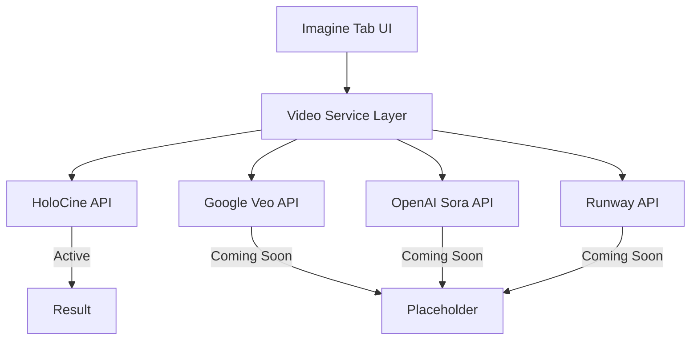

# Happiness AI - Production Ready Implementation Plan

**Created:** 2025-12-03  
**Status:** Ready for Implementation  
**Target:** 100% Production Ready - Grok-Level UI/UX

---

## Executive Summary

This document provides a complete, actionable implementation plan to transform the Happiness AI app into a production-ready, Grok-level experience. Based on comprehensive codebase analysis and the provided Grok reference images, this plan addresses all identified issues systematically.

## Context Engineering Snapshot (2025-12-06)
- **Visual first principle**: Assume every surface displays a Project Airi-quality anime avatar. Use Open-LLM-VTuber assets only as a fallback if Airi pipelines fail. Document any downgrade paths in hand-off notes.
- **Voice directive**: Route spoken responses through IndexTTS by default. ElevenLabs or `expo-speech` are emergency fallbacks and must log provider usage so testers can verify audio provenance.
- **Navigation vocabulary**: Top tabs are strictly `Ask / Alter Ego`. In all prompts and UI copy, refer to selectable characters as "Avatars"; reserve "Alter Ego" for the future adaptive persona feature.
- **UX guardrails**: Reinforce that the chat bar must float above the navbar with a 12–16 px gap and animate alongside the keyboard. Stress that glassmorphism tokens should stay consistent across chat, navbar, and floating controls in both light and dark themes.
- **Frustration refresh**: Remind agents about historical pitfalls—chat bar hiding behind keyboard, theme mismatches, robotic audio—and instruct them to validate on-device before marking tasks complete.

---

## 🎯 Key Issues Identified & Solutions

### 1. Home Page - Dynamic Feed Cards

**Problem:** Cards not updating frequently, not reflective of user context, poor visual design  
**Solution:** GPS-based location, mood tracking, real-time AI suggestions, premium card designs

### 2. Chat Page (Ask Tab)

**Problem:** Doesn't match Grok's premium aesthetic  
**Solution:** Redesign input bar, add quick action buttons, implement Grok-style layout

### 3. Alter-Ego Screen (Ani Tab)

**Problem:** Missing character display, not matching Grok Ani images  
**Solution:** Full-screen character, gradient background, floating controls, "Start talking" button

### 4. Imagine Page

**Problem:** "Dry and boring" layout  
**Solution:** Hero section with user photos, template gallery, floating input bar, video generation

### 5. Settings Page

**Problem:** Most buttons show "Coming Soon" alerts  
**Solution:** Implement all functionality - profile editing, security, subscription, data export, deletion

### 6. All Buttons

**Problem:** Various non-functional buttons throughout app  
**Solution:** Comprehensive audit and fix of every interactive element

---

## 📱 Phase 1: Home Page - Dynamic Feed Enhancement

### 1.1 GPS Location Integration

**Files to modify:**

- `apps/happiness-app/lib/homeFeed.ts`
- `apps/happiness-app/components/tabs/ProfileTab.tsx`

**New file:**

- `apps/happiness-app/lib/locationService.ts`

```typescript
// lib/locationService.ts - Key functionality
import * as Location from 'expo-location';

export interface LocationContext {
  city: string;
  country: string;
  timezone: string;
  weather?: WeatherData;
  isAtHome: boolean;
  nearbyPlaces: string[];
}

export async function getLocationContext(): Promise<LocationContext>;
export async function detectHomeLocation(): Promise<void>;
export function isPrivacyModeActive(): boolean;
```

### 1.2 Enhanced Feed Card Design

**Problem:** Current cards lack visual appeal  
**Solution:** Implement premium card designs with:

- Larger hero images (full-width, 200px height)
- Subtle gradient overlays
- Animated expand/collapse
- Interactive action buttons
- External link support (opens in native browser via `Linking.openURL()`)

**Design specs (matching Grok):**

- Card border radius: 24px
- Glassmorphism: `intensity={isDark ? 60 : 40}`
- Image aspect ratio: 16:9 for hero, 1:1 for thumbnails
- Shadow: `shadowOpacity: 0.15, shadowRadius: 16`

### 1.3 Real-time Feed Updates

**Implementation:**

- Refresh on pull-to-refresh (already exists)
- Auto-refresh every 30 minutes when app is active
- Refresh when location changes significantly (>500m)
- Refresh when user logs mood/activity

### 1.4 AI-Powered Personalization

**Enhanced buildHomeFeed function:**

```typescript
export async function buildHomeFeed(params: {
  userName: string;
  plans: Plan[];
  userId?: string;
  location?: LocationContext; // NEW
  recentMood?: string; // NEW
  activityHistory?: Activity[]; // NEW
}): Promise<FeedCard[]>;
```

---

## 💬 Phase 2: Chat Page - Grok-Style Ask Tab

### 2.1 Reference Analysis (Image 3 from user)

From Grok image analysis:

- Large Grok logo centered when no messages
- Quick action buttons above input: "Voice Mode" | "Create Videos" | Camera
- Input bar: 56px height pill with glassmorphism
- Layout: `[Mic icon] [Input field] [Speak button]`
- Attach icon inside input pill
- "Expert" mode dropdown

### 2.2 File Modifications

**File:** `apps/happiness-app/components/tabs/AskScreen.tsx`

**Changes:**

1. Add centered logo/empty state when no messages
2. Add quick action buttons row above input
3. Redesign message layout (AI = plain text, User = dark bubble)

**File:** `apps/happiness-app/components/chat/ChatInputBar.tsx`

**Changes:**

1. Ensure 56px height pill
2. Add "Expert" dropdown selector (optional)
3. Maintain Mic | Input | Text layout ✓ (already exists)

### 2.3 Quick Action Buttons Component

```typescript
// components/chat/QuickActionButtons.tsx
const QUICK_ACTIONS = [
  { id: 'voice', icon: 'pulse', label: 'Voice Mode', color: '#fff' },
  { id: 'video', icon: 'videocam', label: 'Create Videos', image: true },
  { id: 'camera', icon: 'camera', label: 'Camera' },
];
```

### 2.4 Empty State Design

```
┌─────────────────────────────────────┐
│                                     │
│           [Happiness Logo]          │
│              ⚡ Grok-style           │
│                                     │
│ ─────────────────────────────────── │
│                                     │
│ [Voice Mode] [Create Videos] [📷]   │
│                                     │
│ ┌─────────────────────────────────┐ │
│ │ [📎]  Ask Anything...   [Expert ▼]│ [Speak] │
│ └─────────────────────────────────┘ │
└─────────────────────────────────────┘
```

---

## 🎭 Phase 3: Alter-Ego Screen - Full Grok Ani Experience

### 3.1 Reference Analysis (Images 4, 5, 6 from user)

From Grok Ani images:

- **Full-screen animated character** (not orb)
- **Gradient background:** Purple/pink/magenta hues
- **"Start talking"** centered button when idle
- **Right-side floating menu** with labels:
  - Streaks (with count badge)
  - Capture
  - Outfit (with notification badge)
  - Speaker
  - Settings
  - Close (chevron up)
- **Suggestion chips:** "Surprise Me" | "Teach Me" | "Adventure Time"
- **Bottom bar:** `[Mic] [Video] [Ask Anything input] [Chat button]`
- **Top nav:** Shows "Ask | Imagine | Ani" tabs

### 3.2 File Modifications

**File:** `apps/happiness-app/components/tabs/AlterEgoScreen.tsx`

**Major redesign required:**

```typescript
// New layout structure
<View style={styles.container}>
  {/* Gradient Background */}
  <LinearGradient
    colors={['#1a0a2e', '#2d1b4e', '#4a1942', '#1a0a2e']}
    style={StyleSheet.absoluteFill}
  />

  {/* Full-Screen Character */}
  <View style={styles.characterContainer}>
    {/* Animated character image/Lottie */}
    <Image source={characterImage} style={styles.fullScreenCharacter} />
  </View>

  {/* Right-Side Floating Controls */}
  <View style={styles.floatingControls}>
    <FloatingControl icon="flame" label="Streaks" badge="4" />
    <FloatingControl icon="scan" label="Capture" />
    <FloatingControl icon="shirt" label="Outfit" badge="1" />
    <FloatingControl icon="volume-high" label="Speaker" />
    <FloatingControl icon="settings" label="Settings" />
    <FloatingControl icon="chevron-up" label="Close" />
  </View>

  {/* Start Talking Button (when idle) */}
  {!isListening && (
    <Pressable style={styles.startTalkingButton}>
      <Ionicons name="pulse" />
      <Text>Start talking</Text>
    </Pressable>
  )}

  {/* Suggestion Chips */}
  <View style={styles.suggestionChips}>
    <Chip label="Surprise Me" />
    <Chip label="Teach Me" />
    <Chip label="Adventure Time" />
  </View>

  {/* Bottom Input Bar */}
  <AlterEgoInputBar />
</View>
```

### 3.3 Character Assets Required

**Option A:** Use existing Lottie animations with full-screen sizing
**Option B:** Add static character image assets (recommended for Grok look)

**Asset locations:**

- `assets/characters/alter_ego_idle.png`
- `assets/characters/alter_ego_talking.png`
- `assets/backgrounds/ani_gradient_1.png` (optional)

### 3.4 Floating Controls Component

```typescript
// components/alter-ego/FloatingControls.tsx
interface FloatingControlProps {
  icon: string;
  label: string;
  badge?: string;
  onPress: () => void;
}

const FloatingControl = ({ icon, label, badge, onPress }) => (
  <Pressable style={styles.controlItem} onPress={onPress}>
    <Text style={styles.label}>{label}</Text>
    <View style={styles.iconContainer}>
      <Ionicons name={icon} size={24} color="#fff" />
      {badge && (
        <View style={styles.badge}>
          <Text>{badge}</Text>
        </View>
      )}
    </View>
  </Pressable>
);
```

### 3.5 Alter-Ego Input Bar (Different from Ask)

```typescript
// components/alter-ego/AlterEgoInputBar.tsx
// Layout: [Mic] [Video] [Input: "Ask Anything"] [Chat button]
<View style={styles.inputBar}>
  <CircleButton icon="mic-outline" />
  <CircleButton icon="videocam-outline" />
  <TextInput placeholder="Ask Anything" style={styles.input} />
  <PillButton icon="chatbubble" label="Chat" />
</View>
```

---

## 🎨 Phase 4: Imagine Page - Complete Visual Overhaul

### 4.1 Reference Analysis (Images 1, 2 from user)

From Grok Imagine images:

- **"Animate your photos"** hero section with user's recent photos
- **"See All >"** link to gallery
- **"Create from template"** section with premade templates:
  - "Add Girlfriend", "Thumbs Up", "Money Rain", etc.
- **Large gallery grid** below templates
- **Floating input bar** at bottom: `[avatar] [sparkle] [Type to imagine] [Speak]`
- **Tab navigation** at top: Ask | **Imagine** | Ani (with underline)

### 4.2 New Layout Structure

```typescript
// components/tabs/ImagineTab.tsx - Redesigned
<View style={styles.container}>
  {/* Header with Tab Navigation */}
  <Header tabs={['Ask', 'Imagine', 'Companions']} />

  {/* Scrollable Content */}
  <ScrollView>
    {/* Section 1: Animate Your Photos */}
    <Section title="Animate your photos" action="See All >">
      <HorizontalScroll>
        {userPhotos.map((photo) => (
          <PhotoCard key={photo.id} {...photo} />
        ))}
      </HorizontalScroll>
    </Section>

    {/* Section 2: Create from Template */}
    <Section title="Create from template">
      <TemplateGrid>
        <TemplateCard title="Add Girlfriend" image="..." />
        <TemplateCard title="Thumbs Up" image="..." />
        <TemplateCard title="Money Rain" image="..." />
      </TemplateGrid>
    </Section>

    {/* Section 3: Gallery */}
    <MasonryGrid>
      {generatedImages.map((img) => (
        <GalleryImage key={img.id} {...img} />
      ))}
    </MasonryGrid>
  </ScrollView>

  {/* Floating Input Bar */}
  <ImagineInputBar />
</View>
```

### 4.3 Imagine Input Bar (Grok Style)

```typescript
// components/imagine/ImagineInputBar.tsx
// Layout: [UserAvatar] [SparkleIcon] [Input: "Type to imagine"] [SpeakButton]
<BlurView style={styles.inputContainer}>
  <Image source={userAvatar} style={styles.avatar} /> {/* 40x40 circle */}
  <View style={styles.sparkleButton}>
    <Ionicons name="sparkles" size={20} />
  </View>
  <TextInput placeholder="Type to imagine" style={styles.input} />
  <Pressable style={styles.speakButton}>
    <Ionicons name="pulse" />
    <Text>Speak</Text>
  </Pressable>
</BlurView>
```

### 4.4 Video Generation Integration (HoloCine)

**New service file:** `apps/happiness-app/lib/videoGeneration.ts`

```typescript
// lib/videoGeneration.ts
export interface VideoGenerationService {
  id: string;
  name: string;
  available: boolean;
  comingSoon?: boolean;
}

export const VIDEO_SERVICES: VideoGenerationService[] = [
  { id: 'holocine', name: 'HoloCine', available: true },
  { id: 'veo', name: 'Google Veo', available: false, comingSoon: true },
  { id: 'sora', name: 'OpenAI Sora', available: false, comingSoon: true },
  { id: 'runway', name: 'Runway Gen-3', available: false, comingSoon: true },
];

export async function generateVideo(params: {
  prompt: string;
  service: string;
  duration: number; // 5-30 seconds
  style?: string;
}): Promise<VideoGenerationResult>;
```

**HoloCine Integration:**

- GitHub: https://github.com/yihao-meng/HoloCine
- Use their API or self-host for video generation
- Fallback to "Coming Soon" modal if API unavailable

### 4.5 Model Selection UI (Clean & Minimalistic)

```typescript
// Hidden in "..." menu or bottom sheet, not cluttering main UI
<BottomSheet>
  <Text>Select AI Model</Text>
  {AI_MODELS.map((model) => (
    <ModelOption
      key={model.id}
      name={model.name}
      selected={selectedModel === model.id}
      disabled={!model.available}
    />
  ))}
</BottomSheet>
```

---

## ⚙️ Phase 5: Settings Page - Full Functionality

### 5.1 Current State Analysis

**File:** `apps/happiness-app/app/settings.tsx`

Most settings currently show `Alert.alert('Coming Soon', ...)`. Need to implement:

### 5.2 Functionality Implementation

#### A. Personal Information

```typescript
// settings/PersonalInfo.tsx - New screen
- Edit name
- Edit email
- Edit profile photo (camera/gallery picker)
- Edit timezone
- Update to Supabase on save
```

#### B. Security Settings

```typescript
// settings/Security.tsx - New screen
- Change password (Supabase Auth)
- Enable/disable biometric auth (expo-local-authentication)
- View active sessions
- Two-factor authentication toggle
```

#### C. Subscription Management

```typescript
// settings/Subscription.tsx - New screen
- Show current plan (Free/Pro/Elite)
- Upgrade/downgrade buttons
- Payment history
- Cancel subscription
- Restore purchases (RevenueCat)
```

#### D. Download My Data

```typescript
// lib/dataExport.ts
export async function exportUserData(userId: string): Promise<void> {
  // 1. Fetch all user data from Supabase
  // 2. Package as JSON/ZIP
  // 3. Use expo-sharing to share file
  // 4. Or email link to user
}
```

#### E. Delete Account

```typescript
// lib/accountService.ts
export async function deleteAccount(userId: string): Promise<void> {
  // 1. Show multi-step confirmation
  // 2. Delete all user data from Supabase
  // 3. Delete media from Storage
  // 4. Sign out user
  // 5. Navigate to welcome screen
}
```

#### F. External Links (Open in Browser)

```typescript
// Privacy Policy, Terms of Service
import { Linking } from 'react-native';

const openPrivacyPolicy = () => {
  Linking.openURL('https://happiness-ai.com/privacy');
};

const openTermsOfService = () => {
  Linking.openURL('https://happiness-ai.com/terms');
};
```

### 5.3 Settings Navigation Structure

```
Settings
├── Personal Information → /settings/profile
├── Security → /settings/security
├── Subscription → /settings/subscription
├── Preferences (toggles) → inline
├── Privacy & Data
│   ├── Privacy Policy → opens URL
│   ├── Download My Data → triggers export
│   └── Delete Account → confirmation flow
└── About
    ├── Version → static
    ├── Terms of Service → opens URL
    └── Help & Support → opens email/URL
```

---

## 🎬 Phase 6: Video Generation Integration

### 6.1 Service Architecture



### 6.2 HoloCine Integration

```typescript
// lib/api/holocineService.ts
export interface HoloCineConfig {
  apiEndpoint: string;
  apiKey: string;
}

export async function generateHoloCineVideo(params: {
  prompt: string;
  referenceImage?: string;
  duration: number;
  style: string;
}): Promise<{
  videoUrl: string;
  thumbnailUrl: string;
  processingTime: number;
}>;
```

### 6.3 UI for Video Generation

- Mode selector: Image | **Video** (in ImagineTab)
- Duration slider: 5-30 seconds
- Style presets for video
- Progress indicator during generation
- Preview player when complete

---

## 🔧 Phase 7: Fix All Broken Buttons & Interactions

### 7.1 Button Audit Checklist

#### Home Page (ProfileTab)

- [x] Settings button → navigates to /settings
- [x] Quick action pills → navigate to respective tabs
- [ ] Feed card "View Details" → expands card ✓
- [ ] Feed card external links → open in browser
- [ ] Feed card "Write Your Thoughts" → open journal modal
- [ ] Hero video cards → should play/pause on tap

#### Chat Page (ChatTab)

- [x] Menu button → navigates to /settings
- [x] New Chat button → clears conversation
- [x] Mic button → toggles recording
- [x] Text button → sends message
- [x] Attach button → opens attachment menu
- [ ] Camera (in menu) → should launch camera
- [ ] Photos (in menu) → should open photo picker
- [ ] Files (in menu) → should open document picker
- [ ] Create image (in menu) → should go to Imagine

#### Alter-Ego Screen

- [ ] Streaks button → show streaks modal
- [ ] Capture button → screenshot/record feature
- [ ] Outfit button → show outfit selector
- [ ] Speaker button → toggle audio output
- [ ] Settings button → quick settings modal
- [ ] Suggestion chips → send predefined prompts
- [ ] Video call badge → initiate video call

#### Imagine Page

- [x] Gallery button → toggles gallery view
- [x] PRO upgrade button → shows paywall
- [x] Model selector → opens model picker
- [x] Quality buttons → select quality
- [x] Style chips → toggle style selection
- [x] Aspect ratio buttons → select ratio
- [x] Generate button → starts generation
- [ ] "Use this" on hero cards → sets prompt
- [ ] Gallery thumbnails → show full image
- [ ] Download button → save to device
- [ ] Share button → share image

#### Settings Page

- [ ] Personal Information → edit profile screen
- [ ] Security → security settings screen
- [ ] Subscription → subscription management
- [ ] All toggles → persist to store/Supabase
- [ ] Download My Data → trigger export
- [ ] Delete Account → deletion flow
- [ ] Privacy Policy → open URL
- [ ] Terms of Service → open URL
- [ ] Help & Support → open email/URL
- [ ] Sign Out → sign out and navigate

### 7.2 Implementation Priority

1. **Critical:** All navigation buttons
2. **High:** Action buttons (send, generate, save)
3. **Medium:** Modal triggers
4. **Low:** Enhancement features (share, export)

---

## 🎨 Phase 8: Navigation & UI Polish

### 8.1 Tab Navigation Enhancement

- Ensure smooth swipe between tabs
- Add haptic feedback on tab change ✓ (exists)
- Active tab indicator animation
- Hidden tab bar during voice mode ✓ (exists)

### 8.2 Global UI Improvements

- Consistent border radius (24px for cards, 28px for input bars)
- Consistent glassmorphism intensity
- Smooth animations (300ms duration)
- Loading skeletons for async content
- Error states with retry buttons
- Empty states with helpful CTAs

### 8.3 Dark/Light Theme

- Verify all components respect theme context ✓
- Test contrast ratios for accessibility
- Ensure glassmorphism works in both modes

---

## ✅ Phase 9: Production Readiness & Testing

### 9.1 Performance Optimization

- [ ] Image optimization (use expo-image)
- [ ] List virtualization (FlatList where needed)
- [ ] Memoization of expensive components
- [ ] Animation optimization (useNativeDriver)
- [ ] Bundle size analysis

### 9.2 Error Handling

- [ ] Global error boundary ✓ (exists)
- [ ] API error handling with retry
- [ ] Graceful degradation for offline
- [ ] User-friendly error messages

### 9.3 Testing Checklist

- [ ] All buttons functional
- [ ] All navigation paths work
- [ ] Voice features on real device
- [ ] Image generation end-to-end
- [ ] Settings persistence
- [ ] Pull-to-refresh on all lists
- [ ] Keyboard handling
- [ ] Safe area handling
- [ ] Different screen sizes

### 9.4 App Store Readiness

- [ ] App icon and splash screen
- [ ] Screenshot generation
- [ ] App Store listing copy
- [ ] Privacy policy URL
- [ ] Terms of service URL
- [ ] TestFlight build

---

## 📊 Implementation Timeline

| Phase                 | Duration | Priority |
| --------------------- | -------- | -------- |
| Phase 1: Home Page    | 3-4 days | High     |
| Phase 2: Chat Page    | 2-3 days | High     |
| Phase 3: Alter-Ego    | 4-5 days | Critical |
| Phase 4: Imagine Page | 4-5 days | High     |
| Phase 5: Settings     | 2-3 days | Medium   |
| Phase 6: Video Gen    | 3-4 days | Medium   |
| Phase 7: Button Fixes | 2-3 days | Critical |
| Phase 8: UI Polish    | 2-3 days | Medium   |
| Phase 9: Testing      | 3-4 days | Critical |

**Total Estimated Time:** 25-34 days (4-5 weeks)

---

## 🚀 Recommended Implementation Order

1. **Phase 7: Fix Broken Buttons** - Foundation must work
2. **Phase 3: Alter-Ego Screen** - Biggest visual impact
3. **Phase 2: Chat Page** - Core feature
4. **Phase 4: Imagine Page** - Visual refresh
5. **Phase 1: Home Page** - Dynamic content
6. **Phase 5: Settings** - User trust
7. **Phase 6: Video Generation** - New feature
8. **Phase 8: UI Polish** - Final touches
9. **Phase 9: Testing** - Quality assurance

---

## 📁 New Files to Create

```
apps/happiness-app/
├── lib/
│   ├── locationService.ts        # GPS location context
│   ├── accountService.ts         # Account deletion, export
│   └── api/
│       └── holocineService.ts    # HoloCine video generation
├── components/
│   ├── chat/
│   │   └── QuickActionButtons.tsx
│   ├── alter-ego/
│   │   ├── FloatingControls.tsx
│   │   ├── AlterEgoInputBar.tsx
│   │   ├── SuggestionChips.tsx
│   │   └── CharacterDisplay.tsx
│   └── imagine/
│       ├── PhotosSection.tsx     # "Animate your photos"
│       ├── TemplateGrid.tsx      # "Create from template"
│       ├── GalleryGrid.tsx       # Main gallery
│       └── ImagineInputBar.tsx   # Floating input
├── app/
│   └── settings/
│       ├── profile.tsx
│       ├── security.tsx
│       └── subscription.tsx
└── assets/
    └── characters/
        ├── alter_ego_idle.png
        └── alter_ego_talking.png
```

---

## 🎯 Success Criteria

- [ ] Every button in the app performs its intended action
- [ ] Home feed updates based on location, time, and user activity
- [ ] Chat page matches Grok's visual design
- [ ] Alter-Ego screen shows full-screen character with floating controls
- [ ] Imagine page has hero section, templates, and gallery grid
- [ ] Settings page has fully functional options
- [ ] Video generation available via HoloCine
- [ ] 60fps animations throughout
- [ ] No "Coming Soon" placeholders for core features
- [ ] App feels premium and polished

---

**This plan provides a complete roadmap to achieve 100% production readiness with Grok-level UI/UX.**

🚀 **Ready for implementation!**
